### Hey👋,I'm wushengzhu.
Hi there, I'm **wushengzhu**, a **social worker**. Here are some personal imformations:
     
- 🔭 I’m currently working as a front-end engineer in Guangzhou, China.
- 🌱 I’m currently learning React,qiankun.
- 🎓 I have obtained a Bachelor's degree in Internet of Things Engineering and have graduated for two years now.
- 😄 Pronouns: Don't overestimate a day's progress, don't underestimate a year's accumulation.
- 💬 Ask me about anything, I am happy to help;
- 📫 Please email me if you have any questions 👇.

<!--  -->
<!-- 

-->

### ✉ Contact me:
<!--
- Personal website: 
- Twitter:  
- Weibo: 
-->
- Issues：
- JueJin：
- Email: 

<!-- GitHub 奖杯🏆 
 
-->
### 🔎 Repositorys and Statistics

  
  
  
  
  
   
  
|                        Project                         |                            Stars                              |                            Forks                             |              Remark              |
| :----------------------------------------------------: | :-----------------------------------------------------------------: | :--------------------------------------------------------------------: | :-------------------------------------------------------------------------------: |
| [learn-platform](https://github.com/wushengzhu/learn-platform) |  |  | 在线兴趣学习平台 |
| [mutiplexed-elplus](https://github.com/wushengzhu/mutiplexed-elplus) |   |  | 基于Vue的各种业务组件包  |
| [create-template-cli](https://github.com/wushengzhu/create-template-cli) |  |  | 🚀 初始化项目命令工具 🧰  |
| [auction](https://github.com/wushengzhu/auction) |   |  | 廉洁拍卖系统  |  

<!-- GitHub 数据统计 -->

  

<!-- GitHub 数据统计 -->
<!--

 

-->

<!-- repo 比较好的仓库-->
<!--

  
 

   

-->

<!-- 
Snake Code Contribution Map 贪吃蛇代码贡献图   
<picture>
<source media="(prefers-color-scheme: dark)" srcset="https://cdn.jsdelivr.net/gh/sun0225SUN/sun0225SUN/profile-snake-contrib/github-contribution-grid-snake-dark.svg" />
<source media="(prefers-color-scheme: light)" srcset="https://cdn.jsdelivr.net/gh/sun0225SUN/sun0225SUN/profile-snake-contrib/github-contribution-grid-snake.svg" />

</picture>
-->
### 👨‍💻 Interest and Skills

```mermaid
mindmap
  root((Sapper))
    编程
      Web开发
      Nodejs
      网络爬虫
      Go语言
    摄影
      人文
      建筑
      风景
    旅行
      东莞
      深圳
      珠海
      肇庆
      广州
      桂林
    阅读
      人物传记
      悬疑推理
      余华合集
      中国历史
      心理
      计算机技术
```

  
  
  
  
  
  
  
  
  
  
  
  
  
  
    

<!--
<code>

</code>
<code>
 
</code>
<code></code>
<code></code>
-->
### 👨‍💻 Language usage
 <!-- 在开发软件上开发语言统计 -->
<table>
  <tr>
    <!-- 如vscode需要安装Wakatime插件然后去https://wakatime.com关联github然后获取 -->
    <td></td>
    <td></td>
  </tr>
</table>

